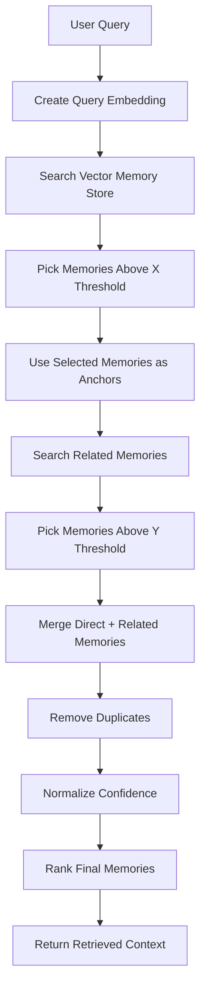
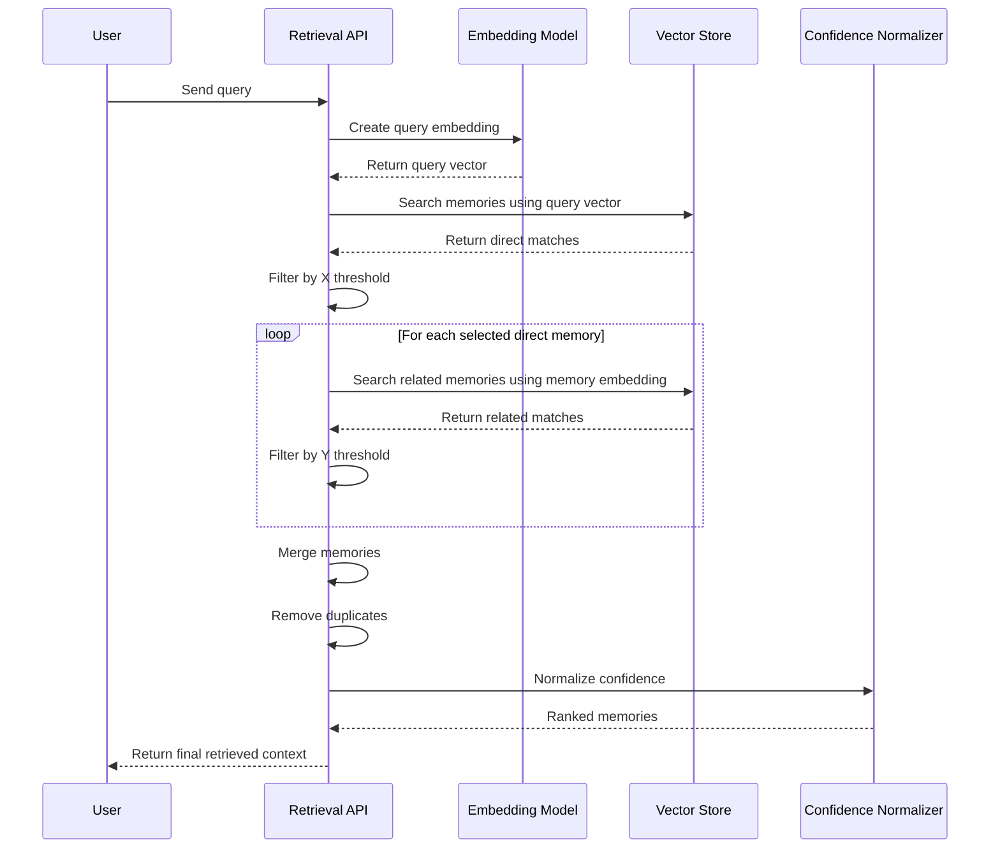
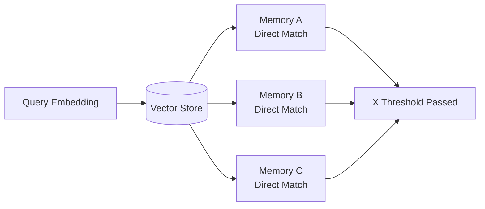
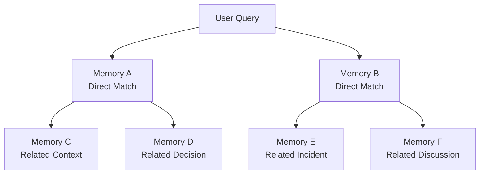
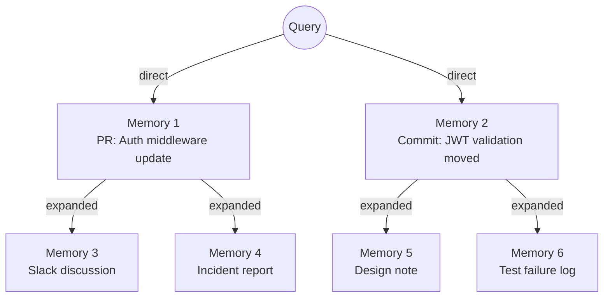
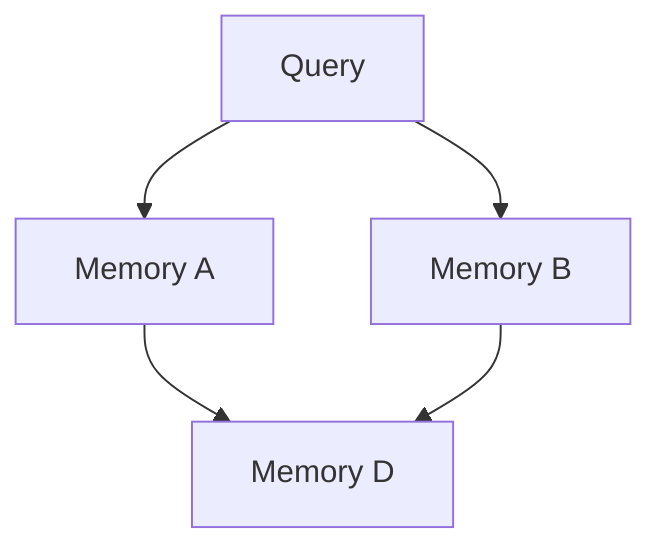
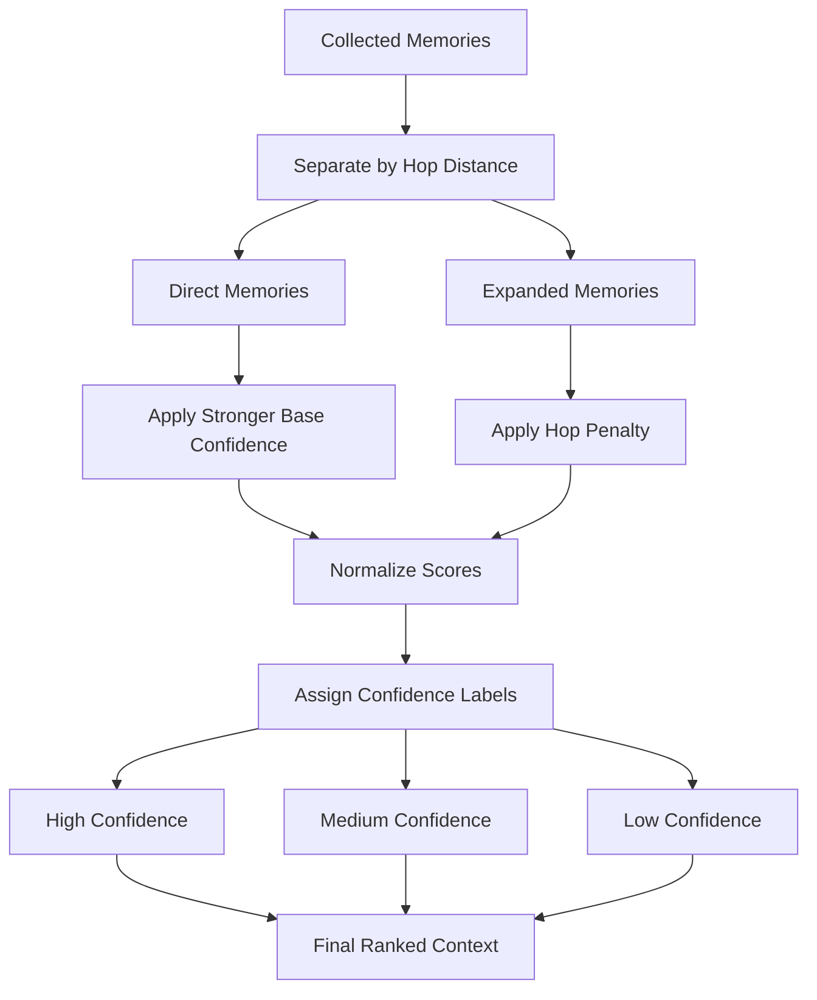
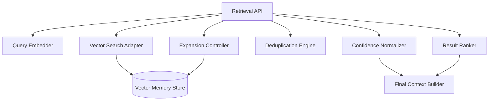

# Component

Retrieval Layer

# Proposed Technology

Multi-Hop Vector Retrieval with Memory Expansion, Threshold Filtering, and Confidence Normalization

# What does this component do?

The Retrieval Layer is responsible for finding the most relevant memories from the company brain memory database.

The core idea is that retrieval should not stop after one search. A user query may directly match only a few memories, but those memories may be connected to more useful context. So the retrieval layer first finds the most relevant memories using vector similarity, then uses those selected memories as anchors to retrieve more related memories.

This makes the retrieval system behave more like connected memory instead of simple search.

The layer does not generate answers. It only returns a ranked set of memory objects with normalized confidence scores.

---

# High-Level Design



---

# Retrieval Philosophy

The retrieval layer follows a staged memory discovery approach.

Instead of doing:

```txt
query → search → return top results
```

we do:

```txt
query → direct memories → related memories → normalized ranking → final context
```

This is important because company knowledge is connected.

For example:

```txt
A query may directly match a GitHub pull request.
That pull request may be connected to a Slack discussion.
That Slack discussion may mention an incident.
That incident may explain why the code was changed.
```

A single vector search may only find the pull request.
The multi-hop retrieval layer can find the supporting context around it.

---

# Internal Memory Object

Every stored memory should have enough metadata for retrieval, expansion, filtering, and confidence scoring.

```ts
type Memory = {
  id: string;

  content: string;
  embedding: number[];

  sourceType: "github" | "slack" | "docs" | "incident" | "meeting" | "ticket";
  sourceId: string;
  sourceUrl?: string;

  createdAt: string;
  updatedAt?: string;

  author?: string;
  repo?: string;
  service?: string;
  team?: string;

  tags: string[];

  linkedMemoryIds?: string[];

  permissionScope: string[];

  retrieval?: {
    hop: number;
    parentMemoryId?: string;
    similarity: number;
    confidence: number;
    confidenceLabel: "high" | "medium" | "low";
  };
};
```

---

# Main Packages / Technologies

## Vector Store

Used to store and search memory embeddings.

Recommended options:

```txt
PostgreSQL + pgvector
Qdrant
Weaviate
Milvus
Pinecone
```

For early Company Brain, **PostgreSQL + pgvector** is enough because it keeps metadata and vectors close together.

For larger scale, **Qdrant** is a better dedicated vector database.

---

## Embedding Model

Used to convert both memories and user queries into vectors.

Recommended options:

```txt
OpenAI text-embedding models
BGE embeddings
Jina embeddings
E5 embeddings
Nomic embeddings
```

The embedding model is used in two places:

```txt
1. When memories are indexed
2. When user queries are searched
```

---

## Retrieval Service

This is the API service that runs the retrieval logic.

Recommended stack:

```txt
Python + FastAPI
or
Go + Fiber / Chi / Gin
```

Python is better if we want faster ML integration.
Go is better if we want a faster production service with lower memory usage.

---

## Cache

Used to avoid recomputing repeated queries.

Recommended:

```txt
Redis
```

The cache can store:

```txt
query hash
query embedding
retrieved memory IDs
final normalized result
```

---

# Retrieval Request Flow



---

# Step 1: Query Embedding

When a query enters the retrieval layer, it is converted into an embedding.

Example query:

```txt
Why did we change the auth middleware?
```

The embedding model converts it into a vector representation.

The retrieval layer does not care about the exact words only. It searches based on meaning.

So this query should also match memories about:

```txt
authentication refactor
JWT verification
session validation
login pipeline
middleware update
```

---

# Step 2: First-Hop Retrieval

The first search uses the query embedding.

This retrieves memories that are directly close to the user query.



Only memories above the first threshold are selected.

The first threshold should be stricter because these are expected to be directly relevant.

Example:

```txt
X threshold: strict
Purpose: select memories that are strongly connected to the query
Output: direct memory candidates
```

---

# Step 3: Anchor-Based Expansion

After first-hop retrieval, the selected memories become anchors.

The system then searches using each selected memory’s embedding.

This allows the system to discover nearby memories that may not directly match the original query but are connected to the first result.



This is useful because the direct memory may be incomplete.

Example:

```txt
Direct memory:
"Auth middleware was updated in PR #482."

Related memory:
"PR #482 was created because login sessions were failing after token rotation."

Related memory:
"Slack discussion explains the production incident that caused the change."
```

---

# Step 4: Second-Hop Threshold

The second-hop retrieval uses a different threshold.

```txt
X threshold = direct relevance threshold
Y threshold = related-memory threshold
```

The second threshold can be slightly more flexible because related memories may not mention the original query directly.

However, it should not be too loose. If it is too low, the retrieval layer will pull unrelated memories.

Recommended behavior:

```txt
First hop:
strict threshold
small result set
high precision

Second hop:
slightly relaxed threshold
limited result set per anchor
relationship discovery
```

---

# Step 5: Retrieval Graph

During retrieval, the layer can internally build a temporary graph of memory relationships.



This graph is not necessarily stored permanently.
It can be built at request time to understand how each memory was retrieved.

Each memory should know:

```txt
was it directly retrieved?
was it expanded from another memory?
which memory pulled it in?
how far is it from the query?
what confidence does it have?
```

---

# Step 6: Duplicate Handling

The same memory may appear from multiple paths.

Example:



In this case, `Memory D` should not appear twice.

The retrieval layer should merge duplicate memories and keep the strongest path.

For each duplicate, preserve useful metadata:

```txt
best parent memory
number of times discovered
strongest retrieval path
highest confidence
all discovery paths
```

This is useful because a memory discovered from many good anchors may be more important.

---

# Step 7: Confidence Normalization

After direct and related memories are collected, each memory receives a confidence value.

The problem is that direct memories and expanded memories are not equal.

A memory directly retrieved from the query should usually have stronger confidence than a memory found through another memory.

The normalization step makes all memory scores comparable.

Instead of returning raw similarity values, the retrieval layer should return clean confidence labels.

Example:

```txt
High confidence
Medium confidence
Low confidence
```

A final retrieved memory can look like this:

```json
{
  "memory_id": "mem_482",
  "hop": 1,
  "confidence": 0.94,
  "confidence_label": "high",
  "retrieval_reason": "Directly matched the query",
  "source_type": "github_pr"
}
```

Expanded memory:

```json
{
  "memory_id": "mem_913",
  "hop": 2,
  "confidence": 0.76,
  "confidence_label": "medium",
  "retrieval_reason": "Related to direct memory mem_482",
  "parent_memory_id": "mem_482",
  "source_type": "slack"
}
```

The user of the retrieval layer should clearly know which memories are strongly trusted and which are only supporting context.

---

# Confidence Normalization Flow



---

# Final Ranking Rules

The final ranking should not depend only on vector similarity.

It should consider:

```txt
direct match strength
hop distance
number of discovery paths
source reliability
freshness
metadata match
permission match
whether exact keywords matched
```

Recommended priority:

```txt
1. Direct high-confidence memories
2. Expanded memories connected to high-confidence direct memories
3. Memories discovered from multiple paths
4. Fresh memories when the query is about current state
5. Older memories when the query asks for history
```

---

# Final Retrieval Response

The retrieval layer should return structured results.

```json
{
  "query": "Why did we change the auth middleware?",
  "retrieval_mode": "multi_hop_vector",
  "thresholds": {
    "direct": "strict",
    "expanded": "related"
  },
  "results": [
    {
      "memory_id": "mem_482",
      "hop": 1,
      "confidence": 0.94,
      "confidence_label": "high",
      "source_type": "github_pr",
      "source_url": "https://github.com/company/api/pull/482",
      "retrieval_reason": "Directly matched the query",
      "content": "Auth middleware was updated to centralize JWT validation."
    },
    {
      "memory_id": "mem_913",
      "hop": 2,
      "parent_memory_id": "mem_482",
      "confidence": 0.76,
      "confidence_label": "medium",
      "source_type": "slack",
      "retrieval_reason": "Related discussion connected to the direct PR memory",
      "content": "The change was discussed after login sessions failed during token rotation."
    }
  ]
}
```

---

# API Design

## Retrieve Context

```http
POST /retrieve
```

Request:

```json
{
  "query": "Why did we change the auth middleware?",
  "top_k": 12,
  "max_hops": 2,
  "direct_threshold": "strict",
  "expansion_threshold": "related",
  "filters": {
    "repo": "backend-api",
    "source_type": ["github", "slack", "docs"]
  }
}
```

Response:

```json
{
  "results": [],
  "retrieval_graph": {},
  "confidence_summary": {
    "high": 3,
    "medium": 5,
    "low": 2
  }
}
```

---

# Internal Components



## Query Embedder

Creates an embedding for the user query.

## Vector Search Adapter

Talks to the vector database and performs nearest-neighbour search.

## Expansion Controller

Takes selected direct memories and uses them as anchors to search for related memories.

## Deduplication Engine

Removes repeated memories found through multiple paths.

## Confidence Normalizer

Converts raw retrieval scores into comparable confidence values.

## Result Ranker

Sorts memories based on confidence, hop distance, source reliability, freshness, and metadata match.

## Final Context Builder

Returns the final structured memory list to the caller.

---

# Configuration

```yaml
retrieval:
  mode: multi_hop_vector

  direct:
    enabled: true
    threshold: strict
    top_k: 20

  expansion:
    enabled: true
    max_hops: 2
    threshold: related
    top_k_per_anchor: 5

  confidence:
    normalize: true
    labels:
      high: 0.85
      medium: 0.65
      low: 0.45

  deduplication:
    enabled: true
    strategy: strongest_path

  ranking:
    prefer_direct_matches: true
    use_hop_penalty: true
    use_source_reliability: true
    use_freshness: true

  safety:
    enforce_permissions: true
    max_total_memories: 50
```

---

# Why this design?

This design is useful because company memory is not flat.

One useful memory usually points to another useful memory. A commit may point to a pull request. A pull request may point to a discussion. A discussion may point to an incident. The retrieval layer should be able to follow those relationships without blindly returning everything.

Multi-hop retrieval gives us a controlled way to expand memory search while still keeping the output ranked and trusted.

---

# Advantages

* Finds direct memories and supporting context.
* Works better than single-pass vector search.
* Can discover hidden context around decisions, incidents, bugs, and discussions.
* Confidence normalization makes results easier to trust.
* Hop distance helps separate primary evidence from supporting evidence.
* Duplicate handling prevents repeated memories from polluting the context.
* Thresholds control how wide or narrow retrieval should be.

---

# Limitations

* More expensive than single vector search.
* More latency because multiple searches are performed.
* Bad thresholds can either miss useful context or retrieve unrelated memory.
* Expansion must be limited to avoid memory explosion.
* Confidence normalization needs tuning with real data.
* Permission filtering must be applied at every retrieval step.
